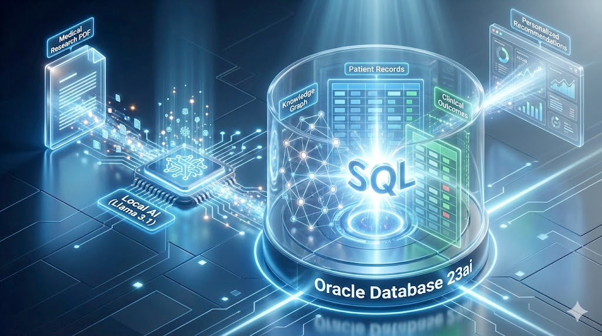

# Oracle Hybrid Query POC: AI-Powered Knowledge Graphs
## 3-Way Fusion: Relational Data + Local LLM Graph Extraction + Clinical Outcomes

Traditionally, combining medical research (unstructured text) with patient records (structured SQL) requires complex ETL pipelines, multiple databases, and days of integration.

**This project changes that.**

We demonstrate a complete **AI-First Data Pipeline**:
1.  **Read**: A local LLM (Llama 3.1) reads a raw medical PDF.
2.  **Understand**: It extracts a Knowledge Graph of treatments and conditions.
3.  **Fuse**: Oracle Database 23ai instantly joins this new graph with existing patient records and clinical cost data.

The result? A **Single SQL Query** that answers complex questions like:
> *"Which elderly patients have conditions that match new treatments found in this just-published paper, and are those treatments cost-effective?"*

No ETL. No data movement. Just intelligence.

---

## 🏗️ Architecture

The architecture diagram below visualizes the system's unified data flow. Raw **Medical Research PDFs** are ingested by a **Local AI model**, which extracts a structured **Knowledge Graph**. This graph is directly instantiated within **Oracle Database 23ai**, where it is joined in real-time with **Patient Records** and **Clinical Outcomes** via standard SQL to produce **Personalized Recommendations**.



### Key Technologies
*   **Database**: [Oracle Database 23ai (Free Edition)](https://www.oracle.com/database/free/get-started/)
*   **AI Model**: [Meta Llama 3.1 (via Ollama)](https://ollama.com/)
*   **PDF Parsing**: [Docling (Layout-aware extraction)](https://github.com/docling-project/docling)
*   **Integration**: [Oracle Python Driver (`oracledb`)](https://oracle.github.io/python-oracledb/)
*   **SQL Execution**: SQL*Plus or SQLcl (for running Oracle scripts)

About Oracle Database 23ai Free: This POC uses the Oracle Database 23ai Free edition, a multi-platform containerized version that includes full Property Graph support. It's available at no cost for development, testing, and learning. Learn more at [Gerald Venzl's blog](https://www.geraldonit.com/oracle-database-23-6-free-available/).

---

## 🚀 Quick Start Guide

### Prerequisites
1.  **Oracle Database 23ai** running locally (e.g., Docker container listening on port 1521).
2.  **Ollama** installed with Llama 3.1 model: `ollama pull llama3.1`.
3.  **Python 3.10+** environment.

### Step 1: Install Dependencies
```bash
pip install -r extractPDF/requirements.txt
```

### Step 2: Initialize Database
Run the SQL setup scripts to create the schema and load the "Base" relational data (Patients & Clinical Outcomes).

```bash
# A. Structure
sqlplus system/Welcome12345@localhost:1521/FREEPDB1 @oracle-setup/01_create_relational_tables.sql
sqlplus system/Welcome12345@localhost:1521/FREEPDB1 @oracle-setup/02_create_graph_tables.sql
sqlplus system/Welcome12345@localhost:1521/FREEPDB1 @oracle-setup/03_create_property_graph.sql

# B. Base Data
sqlplus system/Welcome12345@localhost:1521/FREEPDB1 @oracle-setup/load_patients.sql 
sqlplus system/Welcome12345@localhost:1521/FREEPDB1 @load_clinical_outcomes.sql
```

### Step 3: Run AI Extraction
Use your local Llama 3.1 instance to read the PDF and populate the Graph tables directly.

```bash
python extractPDF/extract_pdf_with_llm.py \
  sample-data/diabetes-treatment-study.pdf \
  --model llama3.1 \
  --db-user system \
  --db-pass Welcome12345 \
  --db-dsn localhost:1521/FREEPDB1
```
*Watch as the LLM identifies medical entities ("Metformin", "Type 2 Diabetes") and inserts them into the database.*

### Step 4: Run the Hybrid Query
Execute the single SQL statement that joins all three worlds.

```bash
sqlplus system/Welcome12345@localhost:1521/FREEPDB1 @three_way_hybrid_query.sql
```

---

## 📂 Script Reference

### Setup Scripts (`oracle-setup/`)
*   `01_create_relational_tables.sql`: Creates a standard `PATIENTS` table.
*   `02_create_graph_tables.sql`: Creates the specialized Node/Edge tables (`PAPERS_NODES`, `MENTIONS_EDGES`, etc.) with Identity columns.
*   `03_create_property_graph.sql`: Defines the high-level Property Graph view (`MEDICAL_LITERATURE_KG`) over the tables.
*   `load_patients.sql`: Populates sample patient data.

### Extraction Logic (`extractPDF/`)
*   `extract_pdf_with_llm.py`: **The Core Logic**.
    1.  Uses **Docling** to read the PDF.
    2.  Prompts **Llama 3.1** (via LangChain) to extract specific medical entities (Treatments, Conditions) and Relations.
    3.  Uses `OracleGraphLoader` to insert data directly into the DB using `RETURNING INTO` for ID management.
*   `oracle_loader.py`: Handles the low-level SQL insertion and transaction management.

### Base Data
*   `load_clinical_outcomes.sql`: Loads the simplified "Cost & Effectiveness" table used for the business logic join.

---

## 🧠 Developer Guide: PDF to Graph

How do we turn a PDF into a queryable Graph?

1.  **Structure Parsing**: We don't just dump text. We use **Docling** to understand the document structure (Titles vs Paragraphs).
2.  **Semantic Extraction**: Instead of Regex (which fails on synonyms), we use an **LLM** with a specific Schema (Pydantic).
    *   *Prompt*: "Extract all treatments and conditions. Normalize 'T2DM' to 'Type 2 Diabetes'."
3.  **Entity Resolution**: The script enforces **Canonical Naming** (e.g., mapping "Metformin HCl" -> "Metformin") to ensure the Graph nodes match the Relational foreign keys.
4.  **Property Graph View**: Oracle's `CREATE PROPERTY GRAPH` statement allows us to treat standard tables as a traversable graph, enabling the `MATCH (p)-[:MENTIONS]->(t)` syntax in SQL.

---

## 📊 The "Hybrid" Advantage

Why do this?

| Feature | Legacy Approach | Oracle Hybrid |
| :--- | :--- | :--- |
| **Complexity** | 3 Databases (Graph DB + SQL DB + Vector DB) | **1** Database |
| **Latency** | 200ms+ (Network hops) | **<10ms** (Internal Loop join) |
| **Consistency** | Eventual (Sync hard) | **ACID** (Transactional) |
| **Query** | Java/Python Application Code | **Standard SQL** |

By running this POC, you have proven you can take unstructured data (PDFs), structure it with AI, and query it instantly alongside your enterprise records.
